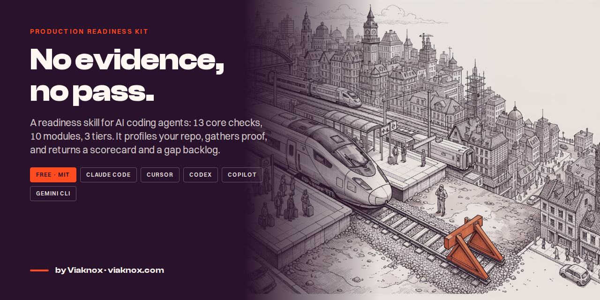
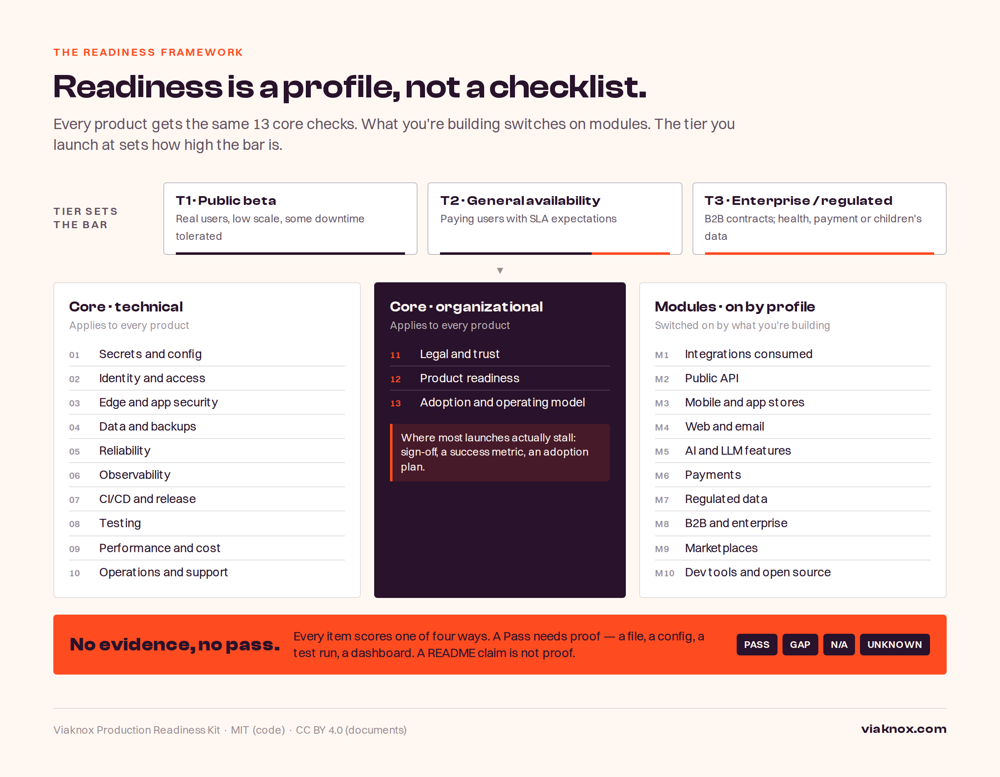
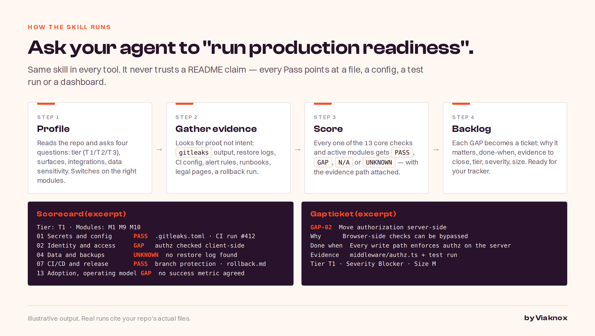

<p align="center">
  
</p>

<h1 align="center">Production Readiness Kit</h1>

<p align="center">
  <strong>AI made software fast to build and no faster to ship.</strong><br>
  This kit takes an AI-built product from demo to production with one rule: <em>no evidence, no pass.</em>
</p>

<p align="center">
  <a href="#quick-start">Quick start</a> ·
  <a href="#the-framework">The framework</a> ·
  <a href="#whats-in-the-kit">What's in the kit</a> ·
  <a href="#how-a-run-works">How a run works</a> ·
  <a href="#faq">FAQ</a> ·
  <a href="https://viaknox.com/blog/fast-to-build-slow-to-ship">Read the article</a>
</p>

<p align="center">
  
  
  
  
</p>

---

## Why this exists

A working demo now takes days. Getting it safe, reliable, supported and actually used still takes months — and most never get there. A 25% rise in AI adoption is modelled to cut delivery stability by 7.2% ([DORA 2024](https://dora.dev/research/2024/dora-report/)); AI-generated code introduced security flaws in 45% of tests ([Veracode 2025](https://www.veracode.com/resources/analyst-reports/2025-genai-code-security-report/)); 74% of companies have yet to show tangible value from AI ([BCG](https://www.bcg.com/publications/2024/wheres-value-in-ai)).

The demo works. What's missing is everything a demo never has to survive. This kit is the checklist, the scoring rule and the agent skill that closes that gap — free, and inside the AI coding tool you already use.

## Quick start

Ask your agent to **"run production readiness"** after installing the skill for your tool.

| Tool | Install |
|---|---|
| **Claude Code / Cowork** | `npx skills add viaknox/production-readiness` — or copy `skills/production-readiness/` into `.claude/skills/` |
| **Cursor** | Copy `skills/production-readiness/` into your repo and `adapters/cursor/production-readiness.mdc` into `.cursor/rules/` |
| **Codex** | Copy `skills/production-readiness/` into your repo and append `adapters/codex/AGENTS.md` to your `AGENTS.md` |
| **GitHub Copilot (VS Code)** | Copy `skills/production-readiness/` into `.github/skills/` ([docs](https://code.visualstudio.com/docs/agent-customization/agent-skills)) |
| **Gemini CLI** | Copy `skills/production-readiness/` into `.gemini/skills/` |
| **No agent at all** | Print `scorecard/production-readiness-scorecard.md` and work through it by hand |

Then:

```text
> run production readiness

Profiling repo… tier T1 · surfaces: web app, public API · modules on: M1 M2 M5
Gathering evidence… 31 items checked, 19 with evidence
Scorecard: 14 PASS · 9 GAP · 3 N/A · 5 UNKNOWN
Blockers for T1: 3  → see readiness/backlog.md
```

## The framework

<p align="center">
  
</p>

Readiness is a profile, not a checklist.

- **13 core domains** (189 individual checks across domains and modules) apply to every product — 10 technical (secrets, identity, edge security, data and backups, reliability, observability, CI/CD, testing, performance and cost, operations) and 3 organizational (legal and trust, product readiness, adoption and operating model).
- **10 modules** switch on by what you're building: integrations, public API, mobile and app stores, web and email, AI/LLM features, payments, regulated data, B2B and enterprise, marketplaces, dev tools and open source.
- **3 tiers** set the bar: **T1** public beta · **T2** general availability · **T3** enterprise or regulated.

Three rules make it work:

1. **No evidence, no pass.** A Pass needs proof — a file, a config, a test run, a dashboard. A README claim is not proof.
2. **Verify the rules live.** App store, OAuth, payment and email-sender rules change every year. The skill checks vendor documentation, not memory.
3. **Governance runs inside the workflow.** Checks live in CI, pull requests and the product — not in a meeting the week before launch.

## How a run works

<p align="center">
  
</p>

## What's in the kit

```text
production-readiness/
├── skills/production-readiness/
│   ├── SKILL.md              # the skill: profile → evidence → assess → deliver
│   ├── checks/               # 23 files: core-01…core-13 + m01…m10 — 189 items, each with tier + evidence
│   └── templates/            # profile.md · scorecard.md · gap-ticket.md
├── adapters/
│   ├── cursor/production-readiness.mdc
│   ├── codex/AGENTS.md
│   ├── copilot/README.md
│   └── gemini/README.md
├── scorecard/
│   └── production-readiness-scorecard.md   # printable self-check, generated from checks/
├── docs/                     # images used in this README
├── CONTRIBUTING.md · CHANGELOG.md
└── LICENSE (MIT — code) · LICENSE-docs (CC BY 4.0 — documents)
```

| Piece | Who it's for | What it does |
|---|---|---|
| **Readiness skill** | Engineers, via their AI coding agent | Profiles the repo, gathers evidence, returns a scorecard and a gap backlog |
| **Tool adapters** | Teams on Cursor, Codex or plain shells | Point each tool at the same skill, so every team runs one standard |
| **Printable scorecard** | Founders, product and enterprise leaders | The 13 domains and 10 modules as a one-page self-check — no code needed |
| **Gap ticket template** | Anyone running the backlog | Each gap as a ticket: why, done-when, evidence to close, tier, severity, size |
| **Roll-up and sign-off** | Whoever says GO | Per-domain % PASS, blocker flags and a three-role sign-off block on every scorecard |

## Who this is for

| You are | Start here |
|---|---|
| A **founder or product lead** with an AI-built MVP | The 30-day path to T1 in [the article](https://viaknox.com/blog/fast-to-build-slow-to-ship#how-do-you-get-an-ai-built-product-production-ready-in-30-days), then run the skill |
| An **engineering lead** | Install the skill, run it on `main`, put the scorecard in the PR template |
| An **enterprise leader** | Use the printable scorecard to set one readiness profile across teams |

## FAQ

**Does it change my code?**
No. It reads, checks and reports. Fixing gaps is yours — the backlog tells you what "done" looks like for each.

**Does a Pass mean I'm safe?**
It means there is evidence for that item at that tier. It is not a pen test, an audit, or a certification.

**Which tier should I pick?**
If real users can tolerate some downtime and nobody is paying yet, T1. If people pay or expect an SLA, T2. If there are B2B contracts or health, payment or children's data, T3. Enterprise controls on a 50-user beta waste months; beta controls on a paid product lose customers.

**Can I adapt it for my company?**
Yes — MIT for the code, CC BY 4.0 for the documents. Keep the attribution.

## Contributing

Issues and pull requests welcome. See [CONTRIBUTING.md](CONTRIBUTING.md). Checks are one file each under `skills/production-readiness/checks/`; every check must say what evidence satisfies it.

---

<p align="center">
  Built and run by <a href="https://viaknox.com">Viaknox</a> · <a href="https://viaknox.com/blog/fast-to-build-slow-to-ship">Fast to Build, Slow to Ship</a> · <em>Potential. Amplified.</em>
</p>
